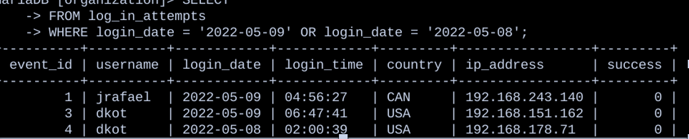
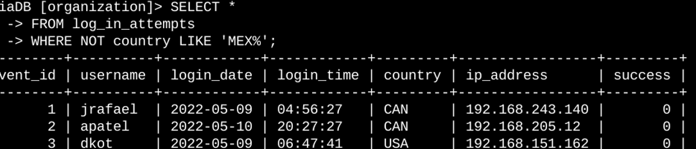
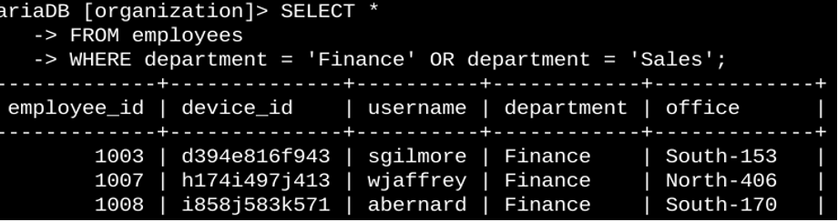

# 🧮 SQL Log Filtering for Threat Detection & Security Investigations

## 🎯 Objective
Use SQL queries to analyze security and user access data in order to detect suspicious login activity and evaluate access permissions across multiple departments.

---

## 🧰 Tools & Logs Used
- SQL
- Login event dataset (Google Cybersecurity Certificate lab environment)
- Employee directory dataset

---

## 🧠 Skills Demonstrated
- Incident scoping through date-based filtering
- Identification of failed login attempts (brute force indicators)
- Geo-based anomaly detection (logins from unexpected locations)
- Access control verification for sensitive departments (Finance, Sales)
- Data extraction to support SOC investigations

---

## 🔍 Investigative Queries Performed

### 1️⃣ Failed Login Attempts
Focused on accounts with multiple failed attempts to detect password-guessing attacks.

```sql
SELECT *
FROM log_in_attempts
WHERE status = 'FAILED';

### 2️⃣ Date-Based Filtering for Incident Timeline Scoping
SELECT *
FROM log_in_attempts
WHERE timestamp BETWEEN '2024-10-01' AND '2024-10-31';

3️⃣ Geo-Anomaly Filtering (Outside Mexico)
SELECT *
FROM log_in_attempts
WHERE country != 'Mexico';

4️⃣ Access Review — Marketing Team Users
SELECT *
FROM employees
WHERE department = 'Marketing';

5️⃣ Sensitive Roles: Finance or Sales
SELECT *
FROM employees
WHERE department = 'Finance'
   OR department = 'Sales';

## 🖼 Evidence & Screenshots


*Filtered results showing multiple failed authentication attempts.*

---


*Logs scoped to a specific time window for incident analysis.*

---


*Login attempts originating outside Mexico for anomaly detection.*

---


*Employees in sensitive departments: Finance and Sales.*

  
